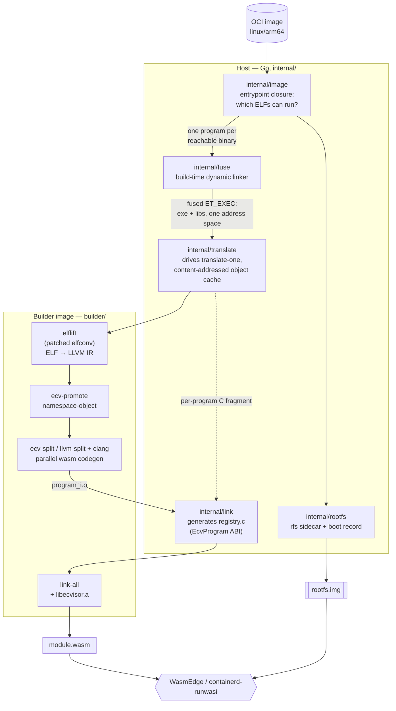
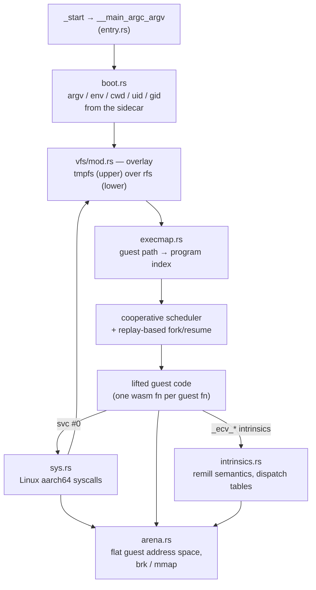

# Raptormark


Ahead-of-time translation of **aarch64 Linux container images into a single
WebAssembly module**, with a purpose-built supervisor runtime instead of a
kernel.

raptormark takes an OCI image, works out which binaries its entrypoint can
actually reach, statically links each one against its shared libraries, lifts
the resulting machine code to LLVM IR with a patched
[elfconv](https://github.com/yomaytk/elfconv), and emits one WASI module that
carries the whole container: the programs, a compressed read-only filesystem,
and the container's personality (argv, env, cwd, uid/gid). The module is
verified on WasmEdge directly and through released containerd/runwasi. The
default profile imports WasmEdge's non-standard preview1 socket extensions, so
wasmtime cannot run it. Two further profiles drop them: `--profile loopback`
runs on stock wasmtime with an in-process network, and `--profile browser` runs
**in a browser tab** over a purpose-built import module, with the guest handing
control back to the page instead of blocking it. Neither has external network
egress yet.

There is no emulator and no interpreter in the output. Guest machine code
becomes wasm functions; guest syscalls become Rust.

## Goal

Run an unmodified `linux/arm64` container image on a wasm runtime, at native
wasm speed, with no source, no recompilation, and no cooperation from the image
itself.

This is bounded by what can be known ahead of time. A survey of eight official
arm64 images:

| image | programs | libs | lift MiB | required strategy |
|---|---|---|---|---|
| `postgres:17` | 71 | 49 | 88.1 | compiled — liftable |
| `redis:7-alpine` | 3 | 4 | 22.7 | compiled — liftable |
| `nginx:alpine` | 3 | 5 | 10.3 | compiled — liftable |
| `python:3-slim` | 1 | 4 | 7.9 | interpreted |
| `ruby:3-slim` | 2 | 8 | 24.0 | interpreted by default; optional YJIT |
| `php:8.3-cli` | 6 | 42 | 48.7 | interpreted + 2 native extensions |
| `node:22-slim` | 3 | 7 | 121.4 | **JIT** |
| `eclipse-temurin:21-jre-alpine` | 7 | 10 | 10.8 | **JIT** |

Compiled and interpreted images are in scope. JIT images are not a coverage gap
to be closed: a runtime that emits aarch64 as it runs has no machine code to
lift ahead of time.

That boundary is about the guest's execution mode, not only its image name.
`ruby:3-slim` has YJIT compiled in but disabled by default: interpreter execution
is in scope, while a run started with `--yjit` crosses the AOT boundary.

The reference target is the official **postgres** image; `openssl` and
`nginx:alpine` are the working fixtures today.

## Architecture

Four stages, three of which are Go code in `internal/` driving tools that live
inside a builder Docker image.



### 1. Discovery — `internal/image`

Reads the image config, exports its filesystem, and computes the closure of
aarch64 executables reachable from the entrypoint by `exec`. Only that closure
becomes programs; the rest of the filesystem is payload.

Packaging follows the **full-fuse execve model**: every unit is a self-contained
program with its own entry in the exec map, so an `execve` inside the guest is a
lookup in the registry rather than a load.

### 2. Fusing — `internal/fuse`

`elflift` cannot lift a dynamic executable. `internal/fuse` is a build-time
dynamic linker that removes the need for one: it maps an executable and its
`DT_NEEDED` closure into a single address space at distinct bases, merges
sections (`.text`, `.got.l0`, `.data.l1`, …), lays out static TLS, resolves
every relocation eagerly — including RELR and IFUNC, whose resolvers are
*interpreted* at build time — and emits one `ET_EXEC` image with synthetic
program headers and a merged symbol table.

Binding is eager and no runtime loader is involved: a PLT stub lifts as ordinary
code that loads a pre-resolved GOT slot and branches indirectly.

It also emits the bring-up tables the supervisor needs, since a fused image has
no `ld.so` to run them: `.ecv.init` (constructors), `.ecv.early`
(`__libc_early_init`), `.ecv.stacklists` (`_rtld_global` thread lists),
`.ecv.irela` (deferred ifuncs) and `.ecv.dlsyms` (for intercepted `dlopen`/`dlsym`).

Function boundaries drive lift quality, so they are recovered from three
independent sources: the symbol table, `.eh_frame` FDEs (glibc), and computed
code pointers (musl, which ships almost no unwind data).

### 3. Translation — `raptormark translate-one`, driven by `internal/translate`

Inside the builder image, per program:

```
ELF → elflift → .bc → ecv-promote → namespace-object → internalize/globaldce
    → ecv-split / llvm-split → clang -O3 (parallel) → program_i.o
```

`namespace-object` tags every local symbol with the module id so N programs can
share one link. `internalize` leaves exactly one exported symbol per program:
its `EcvProgram` descriptor.

The content-stable path uses `ecv-split` instead of `llvm-split`. With a
closure-wide library layout, address-derived shared names, and
`RAPTORMARK_LIB_RANGES`, each reusable partition belongs to one library rather
than to an arbitrary fixed bucket. On the measured PostgreSQL closure this cut
the marginal cost of initdb + dash after postgres from 19m11s to 5m49s. The
shared-name and stable-partition path remains opt-in. Its byte-affecting
settings are included in `TranslateID`, and therefore in `ObjectKey`, so
differently configured translations cannot collide in the object cache.

Objects are cached by content-addressed key (`ObjectKey`) over the patched
base image's digest, a hash of the translation pipeline's own sources
(`internal/builder.TranslateSH`), the ELF, and the codegen options — so a change
confined to `runtime/` reuses every translated object and costs only the final
link. Enable with `RAPTORMARK_OBJECT_CACHE=<dir>`.

Per-library lift caching is automatic when library ranges and a persistent
partition or object cache are available. `RAPTORMARK_LIB_CACHE` overrides its
location; `RAPTORMARK_NO_LIB_CACHE` disables it for differential checks.

### 4. Linking — `internal/link` + `link-all`

`internal/link` generates the C registry that binds each program's renamed
`_ecv*` symbols into an `EcvProgram` descriptor array. `link-all` compiles it
and links the N objects with `libecvisor.a` into one module.

`link.WriteLinkInputs` writes the registry and `programs.json` manifest from one
program list. Sidecar generation consumes that manifest instead of deriving
module identities a second time.

The same `-fPIC` objects support `link-all --side-out <dir>`, which keeps the
flat module and additionally emits one side module per program plus
`supervisor.wasm`. The protocol runs in the development embedder; no shipping
host owns it yet.

### The runtime — `runtime/` (ecvisor)

ecvisor is the project's novel component: a ~7.7k-line Rust `wasm32-wasip1`
staticlib that replaces upstream elfconv's entire C++ runtime. The lifted code
treats its former `RuntimeManager*` as an opaque pointer into ecvisor's own
context; no C++ object ever exists in the module.



Interception is layered — L0 instruction semantics, L1 syscalls, L2 libc, L3
whole libraries — which is what keeps the same conversion core aimed at
different hosts. The server profile (containerd/runwasi + wasmedge) intercepts
at L1 in `sys.rs`; constrained hosts would have to intercept higher, because
every un-lifted library is bundle bytes not shipped.

The VFS is pluggable behind one coordinator that owns path normalization and
cross-layer symlink resolution — squashfs, passthrough or network backends slot
in without touching the syscall layer.

Blocking is part of the guest ABI, not an implementation detail. A guest
descriptor marked non-blocking receives `EAGAIN`/`EINPROGRESS`; a blocking
descriptor suspends its process until host readiness or an absolute deadline.
The idle scheduler polls socket readiness and the earliest deadline together,
so neither wake source can starve the other. This is what lets nginx return to
`epoll_pwait`, run its timer wheel, and keep other connections serviceable.

Process arenas are snapshotted in BOUNDED form, unconditionally (since
2026-08-22): a suspended process stores only its writable image, brk, private
mmap, live stack, and TLS ranges — median 2 MiB, max 6 MiB of a 384 MiB arena
over 102 measured switches — instead of a full-size copy. Allocation zero-fills
and a cross-program switch re-materialises the correct image. There is no
environment variable and no full-buffer alternative: the scheme was opt-in, then
the default, and the gate was removed entirely. A **multi-threaded group** is the
one exception and it is not a mode — a bounded range set derives from one stack
pointer, which says nothing about a sibling thread's stack, so such a group still
takes a full snapshot. Named AF_UNIX sockets
and shared regular-file contents live inside ecvisor, which is what allows
PostgreSQL processes in one module to communicate and observe the same files.

### The scheduler — `runtime/src/entry.rs` + `runtime/src/context.rs`

There is no kernel to preempt anything and no host thread to park, so the
supervisor multiplexes every guest process onto the single wasm stack itself.
The scheduler is **cooperative and single-threaded**: control changes hands only
where a guest process asks it to — a syscall that would block, `sched_yield`,
`clone`/`fork`, `execve`, `exit`/`exit_group`. Nothing is time-sliced; a guest
that computes forever holds the module forever, and that is deliberate, because
there is no interrupt to build preemption on.

**A leg, not a coroutine.** The main loop in `entry.rs` runs one *leg* of the
current process: it calls straight into lifted code and waits for an ordinary
return. There is no asyncify and no exception handling (both are foreclosed —
asyncify is mutually exclusive with the `--fork_emulation` codegen the fork
model needs, and the emitted module must stay inside Wasm 2.0). A blocking
syscall therefore does not unwind a saved stack; it *returns* one:

1. the handler sets `ctx.suspended` and records why (`Pending::{Yield, Block,
   Exit, ExitThread}`, plus a `BlockedOn` for a block);
2. the svc trampoline captures the process's replay state and raises the
   `unwinding` flag — a wasm global, not a context field, because the lifted
   code tests it after every syscall *and* every call: 33,540 sites in the
   linked bash fixture alone, one `global.get` each instead of one call to
   `_ecv_suspended` (elfconv patch 0059);
3. every lifted frame between the syscall and the scheduler sees the flag and
   returns immediately, so the leg comes back by plain return.

The native frames are thrown away, and that is the point: a process's whole
durable state lives in the arena and in its saved `State`, never in wasm locals,
so a suspended process costs no stack.

**Resume is replay, not rewind.** Because the frames are gone, the scheduler
rebuilds them by re-entering each one, innermost first, using the call history
the `fork_emulation` codegen maintains. A suspended process carries a `Replay {
cur, remaining, resuming }`: `cur` is the frame to enter now — a lifted function
plus a mid-body pc, reached through the block-address map — and `remaining` is
the outer frames. Re-entering the innermost frame at its post-SVC pc does *not*
re-execute the `svc`, so the scheduler first drives the syscall handler directly
with `ctx.resuming = true` to finish the call (reap the result, set the return
register, or re-block if it still would). As each reconstructed frame returns,
the scheduler pops the call-history entry the skipped epilogue would have popped
and advances to the next-outer frame at its post-call pc, until it is below the
outermost recorded frame. One mechanism serves every entry: a fork child, a
`clone`d thread, and any process that blocked in a syscall all resume this way;
only a fresh or just-`execve`'d process (`replay == None`) enters at its program
entry instead.

**Process states and their wake sources.** A process is `Runnable`, `Blocked`,
`Zombie(code)` (exited, awaiting `wait4`) or `Dead` (reaped, or a retired
thread — nothing can `wait4` a thread). `Blocked` carries what it is waiting on,
and each reason names exactly one thing that can end it:

| `BlockedOn` | woken by |
|---|---|
| `Wait` | a child of this process becoming a zombie |
| `PipeRead(i)` | a write or a last-writer close on that pipe (another guest process) |
| `UnixAccept { listener }` | another guest process's `connect` to that named AF_UNIX socket |
| `Futex { uaddr }` | a `FUTEX_WAKE` on the same word of a shared segment |
| `Socket { host_fd, write }` | the **host**: readiness observed by the idle poll, or by a running process |
| `Sleep` | the **clock** (its absolute deadline), or a posted signal (→ `EINTR` + remaining time) |
| `Poll` | anything that can change readiness — a pipe write, a posted signal — after which the waiter re-scans its interest list |

Only the socket and clock cases come from outside the guest; everything else is
posted synchronously by another cooperatively-scheduled process, which is why a
missing wake there is a hard deadlock rather than a slow path. Over-waking is
safe by construction — a woken process re-checks its condition and re-blocks —
so `Poll` waiters are woken as a class rather than tracked per fd.

**The idle path.** When the run queue drains with nothing runnable, the
scheduler is not finished; it is idle, and there are exactly two wake sources
left. Servicing either alone starves the other, so they are serviced by one
wait: if anything is parked on a socket, sleep once inside a host `poll_oneoff`
over those fds *bounded by the earliest guest deadline*, then sweep the clock.
With no socket waiters, sleep to the earliest deadline (capped at 5 s, so an
absurd guest timeout cannot wedge the module) and sweep. Only when nothing is
runnable, nothing waits on the host, and no deadline exists is the state
terminal — and even then, processes still `Blocked` is a **deadlock**, reported
with the full `(pid, blocked_on)` list and exit code 111, never a silent exit 0.
Otherwise the module exits with init's status.

Fairness among socket waiters is a rotation, not a queue order: N nginx workers
blocked in `accept` are N waiters on the *same* host fd, the host reports them
all ready at once, and collected in plain index order the first one wins every
time (measured: 100 requests at 25-way concurrency, all served by one of four
workers, on both libcs). A `wake_cursor` rotates both the idle poll's waiter
list and the wake order used when a running process observes readiness.

**Timeouts belong to one wait.** A deadline is cleared at the start of a *fresh*
syscall and preserved across a *resume*, because the wake that brought a process
back may have been spurious and its timeout is still running; a waker never
clears it. The scheduler sets `timed_out` when it releases a process because the
clock passed rather than because someone woke it, which is how the resuming
handler tells `ETIMEDOUT` from success.

**What a context switch moves.** `State` is copied out of and into the one live
register file. The fd table, cloexec/nonblock flags, cwd and signal dispositions
are *moved* by thread-group holder, so a descriptor one thread opens is the same
descriptor to the next thread scheduled; the signal mask and thread-directed
queue are per task and travel with the task alone. Arena buffers are traded
rather than copied, and skipped entirely between threads of one group (they are
the same address space) and when the same process is re-loaded. Dispatch tables
are rebuilt only when the incoming process runs a *different program*, since
they are a pure function of the program: rebuilding them per switch cost 164 ms
on nginx and was the real price of a switch — the 384 MiB arena restore, the
obvious suspect, was ~15 ms of it.

**Signals are delivered at boundaries, synchronously.** There is no
`rt_sigframe` and no asynchronous interruption of arbitrary guest code. Pending,
unblocked signals with an installed handler run at a delivery boundary (chiefly
`epoll_pwait` and the other waiting syscalls) as an ordinary guest call on the
interrupted process's own stack with a cloned `State`. That is the path that
makes PostgreSQL's postmaster advance: a child exits → `SIGCHLD` is posted and
the postmaster is woken from its epoll → the handler runs and `SetLatch()`s →
the latch signalfd becomes readable → the same `epoll_pwait` returns and the
main loop reaps.

**Exit is a scheduler operation.** `exit_group` (and `exit` from the last task
in a group) retires every member, leaves the leader as a `Zombie` carrying the
status, closes all descriptors — which is what gives a pipe reader EOF — drops
the group's shared mappings, wakes a parent parked in `wait4` and posts
`SIGCHLD`. `exit` from one thread of a live group retires that task only and
touches none of the group's shared state. Either way the module keeps running;
it exits when the scheduler has nothing left to run.

### Repository layout

| path | what it is |
|---|---|
| `internal/image` | entrypoint-closure discovery over an OCI image |
| `internal/fuse` | build-time dynamic linker (the hard part) |
| `internal/rootfs` | rfs sidecar writer + boot record |
| `internal/translate` | translate-one driver, translation identity, object cache |
| `internal/builder` | the harness itself: `build-image`, `translate-one`, `link-all` |
| `internal/oci` | packs a module + sidecar into an importable OCI image |
| `cmd/raptormark` | the CLI those four hang off |
| `internal/link` | registry/fragment C generation, `EcvProgram` ABI |
| `runtime/` | ecvisor — the Rust supervisor (wasm32-wasip1 staticlib) |
| `builder/` | builder image Dockerfile + the LLVM companion passes |
| `patches/` | the elfconv fork series (65 patches) |
| `third_party/elfconv` | upstream submodule, pinned clean at `8bfe808` |
| `e2e/` | end-to-end attestation of the whole pipeline |

The fork is kept as an ordered patch series applied inside the builder image,
not as a modified checkout, so the submodule stays clean at its pin and every
patch is individually reviewable.

### Two runtime models

Stage 4 can emit the guest in either of two shapes, and **both come out of one
translation**. Only the final link forks, because every object is compiled
`-fPIC` and a PIC object links flat with an unchanged import surface. Translation
is the expensive half of the pipeline — hours for a large closure — so asking for
the second shape costs about a second of extra linking, not a second pipeline.

```
                     one set of -fPIC objects
                                |
             +------------------+------------------+
             |                                     |
        flat link                     link-all --side-out
             |                                     |
       app.wasm                    supervisor.wasm + one
   (ecvisor linked in)             <program>.side.wasm each
             |                                     |
   a stock runwasi shim                  an embedder you own
```

| | **flat module** | **supervisor + side modules** |
|---|---|---|
| artifact | one `.wasm` with ecvisor linked in | `supervisor.wasm` plus one PIC side module per program |
| host | released `containerd-shim-wasmedge`, unchanged | a host that instantiates several modules and wires them together |
| WASI | supplied by the shim | supplied by that host — 28 imports, 11 of them WasmEdge socket extensions |
| relink after a runtime change | whole module | supervisor only |
| status | **what ships today** | built, tested, and run; no stock shim can load it |

#### Why a stock shim cannot run the split

A released runwasi shim loads a single module file and has no import map. The
side modules import `memory`, `__indirect_function_table`, `__stack_pointer`,
`__memory_base`, `__table_base` and the supervisor's intrinsics from `env`, and
nothing on that path supplies them. That is the whole obstacle — not the module
shape, which stays inside Wasm 2.0 and needs no proposal.

#### What an embedder has to do

The sequence is in `.agents/docs/MULTIMODULE.md` §8 and is executed on every E2E
run by `e2e/testdata/embedder.mjs`:

1. instantiate the supervisor with the WASI imports;
2. read each side module's `dylink.0` MEM_INFO;
3. call the supervisor's `ecv_reserve_side(size, align)` for its memory —
   **not** `memory.grow` and **not** `__heap_base`, both of which let the
   supervisor's own allocator hand the same bytes out again later;
4. take `__table_base` from the current table length and grow the table;
5. instantiate the side module against the supervisor's memory, table and
   shadow stack;
6. call `__wasm_apply_data_relocs()` then `__wasm_call_ctors()`;
7. read the exported `ecv_program_<i>` global — it holds the OFFSET from
   `__memory_base`, not an address;
8. `ecv_register_program(addr, sizeof(EcvProgram))`;
9. `_start()`.

⚠️ `e2e/testdata/embedder.mjs` runs under node and is a **development harness,
not a deployment target**: it cannot supply WasmEdge's socket extensions, and
`node:wasi` needs a private-symbol workaround to survive the guest growing linear
memory at all. It exists so the protocol is executed rather than described.

#### What is settled and what is not

Settled: the protocol works, at real scale. CPython — a 36 MB side module needing
5.75 MB of memory and 12,115 table entries — runs through the sequence above and
prints the same checksum as the native interpreter and as the flat module.
Nothing in the placement turned out to be scale-sensitive.

Not settled: **the runtime cost of the split**. It is not a call-overhead
multiplier but the loss of inlining across a boundary that only exists once the
split does, and it cannot be measured in advance — wasmedge cannot instantiate
two modules, and V8 inlines the cross-module import away. The number appears
after a host is built, not before.

## Building and running

Build the toolchain image (base + fork + ecvisor + LLVM passes):

```sh
git submodule update --init
go run ./cmd/raptormark build-image                        # LLVM 16 line, tags :latest
go run ./cmd/raptormark build-image --llvm 22              # LLVM 22 line
go run ./cmd/raptormark build-image --skip-base --tag mytag
```

`build-image` also cross-builds this same binary for the image's platform and
installs it as the entrypoint, so `translate-one` and `link-all` — which run
*inside* the image — are the same three subcommands:

```sh
go run ./cmd/raptormark --help
```

Drive the pipeline through the end-to-end suite. It is env-gated rather than
build-tagged, so it still compiles and vets normally and skips cleanly on a
machine without Docker:

```sh
RAPTORMARK_E2E=1 RAPTORMARK_BUILDER=raptormark-builder:mytag \
  RAPTORMARK_OBJECT_CACHE="$PWD/.agents-workspace/objcache" \
  go test ./e2e/ -v -timeout 60m

# including the ~30-minute fused-guest lifts
RAPTORMARK_E2E=1 RAPTORMARK_E2E_SLOW=1 \
  RAPTORMARK_BUILDER=raptormark-builder:mytag \
  RAPTORMARK_OBJECT_CACHE="$PWD/.agents-workspace/objcache" \
  go test ./e2e/ -v -timeout 90m
```

The cache directory is created if absent, so a wrong path does not error — it
just makes every run cold. A third variable, `RAPTORMARK_NODE`, is needed
wherever node is not on `PATH`; without it ten tests skip and the suite still
reports a clean pass. See `.agents/docs/QUALITY_GATE.md` §4, which is the one
place that records the working values and the expected pass/skip counts.

Host-side Go tests (`go test ./...`) need neither Docker nor wasm. Ecvisor's
host `cargo test` and `cargo check --manifest-path runtime/Cargo.toml
--target wasm32-wasip1` are both expected to pass. The latter checks the
shipping configuration; runtime behavior still requires the E2E suite. See
`.agents/docs/QUALITY_GATE.md`.

### Packing an OCI image

`raptormark oci` turns the module and its sidecar into a `wasip1/wasm` image tar
that containerd, Docker and a registry all accept:

```sh
go run ./cmd/raptormark oci \
  --module out/nginx.wasm --sidecar out/rootfs.img \
  --from nginx:alpine \
  --ref ghcr.io/me/nginx-wasm:latest -o img.tar

ctr images import img.tar
ctr run --rm --runtime=io.containerd.wasmedge.v1 ghcr.io/me/nginx-wasm:latest x
```

`--from` lifts the personality (env, cwd, argv) off the source image; `--env`,
`--cwd`, `--user` and `--arg` override individual fields.

The image's `os` is `wasip1` by default, matching runwasi's own `oci-tar-builder`
and the demo images containerd is known to accept. Docker documents its Wasm
workloads as `--platform=wasi/wasm`, so `--os wasi` is there for that; the
architecture is always `wasm`, and that is the only field the shim actually
tests (`Arch::Wasm` in `containerd-shim-wasm`'s `client.rs`). Note that Docker's
Wasm support *is* runwasi — Docker Desktop installs `io.containerd.wasmedge.v1`
and friends — so there is one target here, not two. It does require the
containerd image store; with the classic overlay2 store `docker load` rejects
any non-linux image regardless of which `os` string it carries.

**The released `containerd-shim-wasmedge` runs these unmodified** — no fork, no
patched engine, no proposal flags. Measured against containerd 2.2.1 with
runwasi's own shims (`e2e/containerd_test.go` runs containerd in a container to
check): `ctr images import` accepts the tar, containerd records `wasip1/wasm`,
the shim logs *"found manifest with WASM OCI image format"* then *"no WASM layers
found in OCI image"* and takes the file-in-rootfs path, ecvisor reads the sidecar
and echoes the boot record, and the guest exits 0.

`containerd-shim-wasmtime` loads the default module but cannot run it, for an
unrelated reason: ecvisor imports WasmEdge's non-standard preview1 socket
extensions (`sock_open`, `sock_accept` — `runtime/src/net/wasmedge.rs`), which
wasmtime's WASI p1 does not provide. That dependency is old; it was just
invisible while wasmtime rejected the module at parse time.

**A `--profile loopback` module does run on stock wasmtime.** The socket calls
go through a `NetBackend` seam (`runtime/src/net`) whose implementation is
chosen at COMPILE time — a `cfg` type alias, deliberately not a `dyn` or an
enum, either of which would keep every backend live and put every import set in
the module. Linking against the loopback archive takes the probe guest from 28
imports to 15 and `wasmtime` 46.0.1 runs it with no flags
(`e2e/loopback_test.go`). Its network is in-process only, so this is a
portability proof and a browser stepping-stone rather than a way to run a
networked guest under wasmtime.

This is a constraint on the module, not luck. Until 2026-08-09 both shims
rejected every raptormark module with *"This instruction or syntax requires
enabling Exception Handling proposal"*, because `link-all` finalised with
`wasm-opt --translate-to-exnref`. Enabling it shim-side was never really on the
table: runwasi pins `wasmedge-sdk 0.14.0`, whose `CommonConfigOptions` has no
exception-handling field at all, so it meant forking the shim *and* migrating an
engine SDK, for a shim only we could run. Instead, suspension became a plain
return (elfconv patch 0026), and the emitted module now uses nothing beyond
Wasm 2.0. Keep it that way — `TestWasmOptEnablesNoProposal` guards it.

| `--format` | layers | what the shim must do |
|---|---|---|
| `rootfs` (default) | one ordinary layer holding module + `rootfs.img` | nothing — image handling is stock |
| `wasm-layers` | module as `…wasm.component.layer.v0+wasm`, sidecar as `…raptormark.rootfs.v1+rfs`, empty rootfs | accept the rootfs media type and write it out as a file — **no such shim exists or is planned** |

ecvisor loads the sidecar with `fs::read`, so it has to be a file the guest can
open. `rootfs` puts it at `/rootfs.img` and names it in `RAPTORMARK_ROOTFS`, so
the module finds it regardless of cwd. `wasm-layers` has no filesystem at all,
which is the extra work; `oci` warns when you ask for that combination.

## Status

Working today, verified end to end under wasmedge:

- Static aarch64 binaries → WASI module, both on elfconv's upstream C++ runtime
  and on ecvisor.
- Multiple programs linked into one module without symbol collision.
- **Dynamically linked guests.** A Debian aarch64 `openssl`, fused with its full
  shared-library closure and running on ecvisor with a real rootfs and a real
  argv, prints the correct version and exits 0. With the bring-up tables in
  place, provider-dependent commands (`list -providers`, `dgst`) work too.
- **Network servers on both libcs.** Alpine/musl and Bookworm/glibc nginx serve
  real HTTP requests with four workers. Timed `epoll_pwait`, non-blocking
  accept/send/recv, and blocking/non-blocking connect semantics have focused E2E
  guards with native Linux baselines where applicable.
- **PostgreSQL 17 with concurrent guest processes.** One module containing
  dash, initdb, postgres (with extensions), and psql completed initdb and served
  8 simultaneous clients over a guest AF_UNIX socket, with 8/8 clients exiting
  0 and 8/8 rows committed. The measured 2 -> 4 -> 8 ladder peaked at 948 MiB
  under bounded snapshots. **Bounded snapshots became the default on 2026-08-22
  and the flag was removed the same day** — see "Next, in order" below for the
  ruling; without them the full-buffer scheme dies with `memory allocation of
  402653184 bytes failed` the moment psql forks as a fourth process, so this
  result is not reachable on that path at all.
- **Cross-program library partition reuse (opt-in).** On the measured postgres,
  initdb, and dash closure, total translation fell from 66m43s to 46m21s and the
  marginal cost after the first program fell 3.3x. This path requires shared
  names and closure library ranges and is not yet a default build mode.
- Content-addressed object cache: a re-run of `TestUpstreamRuntime` went
  45.16 s → 1.23 s, with the assertion on the *served artifact*, not on the hit.

Not there yet:

- **Threads work; musl's thread bring-up does not.** `clone(CLONE_THREAD)` is
  implemented — a real shared-VM task in the caller's thread group, sharing one
  arena, one fd table, one cwd and one signal state, which the cooperative
  scheduler makes safe because it only switches at a block, a yield or an exit.
  A static-glibc guest creates threads, joins them, shares descriptors both ways
  and keeps separate thread pointers (`e2e/threads_test.go`).

  It does not yet unblock `redis:7-alpine`. A fused image never enters ld.so, so
  musl's `__init_tp` and `__init_tls` never run: `libc.can_do_threads` is now
  seeded from `.ecv.musltp`, but `libc.tls_size`/`tls_align`/`tls_head` are still
  zero, so `__copy_tls` hands `clone` a TLS pointer computed relative to zero.
  Everything before that works, including the config load and
  `Running mode=standalone`. See `.agents/docs/TODO.md`.
- **A fused glibc never reads its auxv.** `_dl_aux_init` runs only on glibc's
  static path and the shared path reads the auxv in `dl_main`, which lives in
  ld.so, which eager binding means the guest never enters. Every `GLRO` field
  that exists only to hold an auxv value therefore stays zero, and the fix for
  each is to write it directly from a prelinker table — `_dl_stack_*` and
  `_dl_minsigstacksize` are done, and any future one will be found the same way:
  as a guest that aborts somewhere unrelated-looking.

  `python:3-slim` used to stop on exactly that, aborting in
  `sysconf(_SC_MINSIGSTKSZ)` after all twelve of its constructors had run. It now
  runs Python, imports and third-party native extensions included:

  ```
  $ python3.14 -c 'print(json.dumps({...}))'
  {"py": "3.14.6", "sum": 5050, "sorted": ["a","k","m","o","p","r","t"], "cs": 3.5}

  $ python3.14 -c '... cryptography: Ed25519 sign+verify, AES-GCM ...'
  CRYPTO2-OK ed25519sig 64 aesgcm secret-payload
  ```

  `cryptography` 50.0.0 works, with SHA-256 matching the host byte for byte.
  Dynamically linked OpenSSL works too — python's `_ssl`/`_hashlib` pull in
  `libssl.so.3` and `libcrypto.so.3` as ordinary DT_NEEDED, and
  `_hashlib.openssl_sha256` matches the host oracle. A full TLS handshake does
  not yet: it reaches libcrypto's SIMD and stops on two unlifted instructions
  (`usubw`, `cmlt`); see `.agents/docs/TODO.md`.
- **No end-to-end driver.** `cmd/raptormark` covers the build steps
- **Plugin discovery is not wired into the pipeline.** `fuse.Options.Extra`
  can admit runtime-loaded objects atomically, and `image.PluginDirs` defines a
  bounded Python/OpenSSL directory policy, but the helper has no production
  caller. Current successful Python extension runs pass the extras explicitly;
  automatic discovery remains work.
  (`build-image`, `translate-one`, `link-all`), but the pipeline that strings
  them together — discovery, fuse, translate, link — still runs only from the
  `e2e/` suite. There is no `raptormark build <image>` or `raptormark run`.
- **Wasmtime socket portability.** The DEFAULT module loads but does not
  instantiate: live ecvisor code imports WasmEdge's non-standard preview1
  socket functions, beginning with `sock_open`. `--profile loopback` removes
  them and runs on stock wasmtime, but gives the guest no external network, so
  the gap that remains is a wasmtime-compatible backend that has one.
- **The browser has no egress.** `--profile browser` boots and runs a guest in a
  tab (`e2e/browser_test.go`, Chromium), with DNS answered in-runtime and
  addresses minted by the host. But a browser cannot open a TCP socket, so
  reaching the network needs a WebSocket relay: the client subprotocol exists
  (`web/src/browser/relay.ts`) and **no relay server does**. Only Chromium has
  been exercised; Firefox and WebKit need system libraries the harness cannot
  install.
- **`--format wasm-layers` has nothing to run it.** The default `rootfs` format
  works on stock shims; the wasm-OCI shape does not, and cannot, because ecvisor
  opens the sidecar with `fs::read` and that shape has no filesystem. It would
  take a shim that materialises the sidecar layer as a file, which nobody is
  going to build or accept upstream. The format stays for sidecar-less modules
  and for feeding other tooling; treat it as unrunnable otherwise.
- **Conversion cost.** The pathological 6.5-hour nginx conversion was reduced
  to about 16 minutes by the tail-call lifter fix. Library-scoped reuse makes
  later programs cheaper; cached work is now dominated by elflift and the
  remaining preparation rather than codegen.
- **Instruction coverage.** Each new image still surfaces aarch64 encodings the
  lifter cannot decode — a class of work, not a bug.
- **Size.** Lifting expands roughly `wasm ≈ 6.89 × .text + 2.37 MB`. Fine for a
  server host; too big for tightly bounded edge runtimes.

Next, in order:

1. **Decide whether content-stable shared partitioning becomes the default.**
   It is built, remains opt-in, and now keys correctly in the object cache
   (`internal/translate/experimental.go`, 2026-08-18), which was the stated
   precondition for promotion.

   * *Content-stable partitioning* (`RAPTORMARK_STABLE_SPLIT`). The pass
     collapsing this list used to ask for is done: `ecv-prepare` merges
     `llvm-link`, internalize/globaldce and namespace-object (default since
     2026-08-13), and this switch folds the split in against a single parse.
     Measured on the 519 MB postgres module: **149 s of the 225 s split is
     parsing what the previous pass just wrote**, ~9% of that closure's
     translation.
   * *Per-library lift caching* (`RAPTORMARK_LIB_RANGES` plus a persistent cache).
     A partition-cache-warm translation is 68% elflift, most of it re-lifting
     libraries another program of the same closure already lifted; the cache is
     now automatic in that regime and keyed per library, so a closure pays once
     per distinct library. Trace-entry
     sharding is not the answer — sampled shards duplicated 80-84% of their
     emitted functions.

   Promoting stable partitioning changes cache identity and invalidates existing
   translated objects, so batch that decision with pending lifter-patch adoption.

2. ~~**Decide whether bounded arena snapshots become the default.**~~
   **DECIDED 2026-08-22, by the user: they are the ONLY scheme, and the flag was
   removed the same day.** The measurements this asked for were in — switch cost
   79 us cross-program and 66 us same-program against 42 us and 35 us unbounded,
   and nginx serving four workers and 100 requests under it byte-identically to
   the unbounded run — and what remained was a ruling, not a measurement. The
   ruling was made on the ceiling rather than on the cost: without bounded
   snapshots there are no guest-side clients at all, because the full-buffer
   scheme dies with `memory allocation of 402653184 bytes failed` the moment
   psql forks as a fourth process.

   The full-buffer path is gone from the switch path with it. `SnapshotData::Full`
   and `Arena::snapshot` stay, because a **multi-threaded group** must still take
   a full snapshot — a bounded range set derives from one stack pointer, and a
   sibling thread's stack is live memory that pointer says nothing about. That is
   a property of the process, decided by `is_multithreaded`, not a mode anyone can
   select. `Arena::swap_with` and `Arena::adopt_shared_from` are kept but are no
   longer on any switch path; their tests are their only callers.

   ⚠️ **What was accepted, not closed — and is now harder to close**: the stack
   BELOW `sp` is outside the copied range set (up to 1,307 bytes observed on
   nginx). Those are dead frames under AAPCS64 — aarch64 has no red zone — and
   the observations are samples rather than bounds. Removing the flag does not
   settle this, and it makes it **unsettleable by differential**: there is no
   unbounded run left to compare against, so `RAPTORMARK_ECV_SNAPCHECK` has lost
   its oracle for every single-threaded switch and now reports `NO-ORACLE`
   instead of a fabricated `miss=0`. Closing it in future needs an argument from
   the ABI or an instrumented guest, not an A/B run. That is a real narrowing of
   the options, taken knowingly. See `.agents/docs/TODO.md`.

3. **Resolve cross-program translation concurrency against the caches.** The
   old unused `RunAll` worker pool was deleted. Concurrent cold translations
   can compile the same libraries independently, defeating reuse; a future
   design must coordinate caches before turning idle cores into useful work.

The open-file-description gap that used to be item 4 is closed. A file offset
now lives in a context-global `file_offsets` table -- the level Linux calls a
`struct file` -- so `dup`, `dup2` and `fork` share one position while a second
`open` of the same path gets its own.

### Honest limits

Properties of the shipping runtime that are easy to meet by surprise. Each was
re-verified against the tree on 2026-08-21 and names the code that makes it
true, so a future reader can check rather than trust.

- **Guest `getrandom` and `/dev/urandom` are NOT cryptographic.** Both are
  served from a deterministic xorshift64\* PRNG (`runtime/src/context.rs`, see
  `rng_state` and `rand_bytes`). Any guest doing its own crypto — a TLS
  handshake, a session key, a password salt, a UUID it treats as unguessable —
  draws from it. This is the sharp one: it is not a browser limitation and it
  predates the browser work, it has simply never been stated where someone
  deploying raptormark would see it.
- **`sendmsg`/`recvmsg` on a host socket return `ENOSYS`** (`runtime/src/sys.rs`,
  `sys_sendmsg` / `sys_recvmsg`). Less exotic than it sounds: curl and some Go
  and Rust runtimes use them on ordinary TCP sockets, so a guest can meet this
  without doing anything unusual. The in-runtime AF_UNIX path is unaffected.
- **A compute-bound guest with no syscalls freezes its host thread.** This
  follows from the cooperative scheduler described above — nothing is
  time-sliced, and there is no interrupt to build preemption on. Stated again
  here because the consequence lands differently per host: under wasmedge it
  holds the module, and in a browser it freezes the page thread, i.e. the tab.

A fourth limit belongs in this list historically and is no longer true: guest
deadlines used to be measured against the WALL clock, so a timer followed NTP
steps, laptop suspend and browser tab throttling. Fixed 2026-08-21 — the runtime
now keeps a separate monotonic base, and `TestGuestTimersSurviveAWallClockStep`
steps the host clock by an hour to guard it.

## License

raptormark is licensed under the **Apache License, Version 2.0**. See
[LICENSE](./LICENSE) for the terms and [NOTICE](./NOTICE) for attribution of the
Apache-2.0 upstreams it builds on — elfconv, Remill, MyAOT and LLVM.

Two scope notes that `NOTICE` states in full and that are easy to get wrong:

* **`tools/decode-oracle/` is not covered by that grant.** It is a separate Go
  module, licensed LGPL-2.1-or-later, because it embeds QEMU's decodetree
  tables. It is a developer-only analysis tool that is never built into, linked
  with, or shipped alongside the pipeline; there is no `go.work`, and nothing in
  the root module imports it. Keeping it out is what leaves this project free to
  be Apache-2.0, so ❌ do not fold it back in for convenience.
* **A module raptormark emits is not covered by that grant either.** It carries
  code translated from whatever guest image was supplied, and those contents
  keep their own licences — commonly glibc or musl. Whoever distributes a
  translated module owns that obligation.
